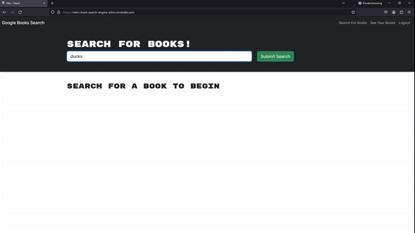
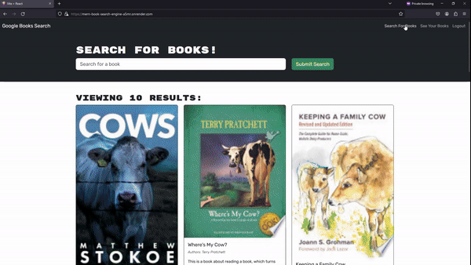

# MERNBook-Search-Engine
This is a browser-based search engine that lets the user create an account, then search for books. This project can be found at this link [https://mern-book-search-engine-a5mr.onrender.com](https://mern-book-search-engine-a5mr.onrender.com)

## Description
This project was a good opportunity for me to learn about MERN and how it is different from a RESTful API. In a RESTful API, you have a controller that contains a limited number of routes that the website uses to handle requests. However, a MERN stack allows for many routes that do not need to be specifically defined due to React’s Outlet module. This, combined with React’s Javascript nature, allows a developer to create a website that can have a flexible number of routes while remaining both scalability and maintainability

This project also gave me the opportunity to use Apollo to manage the Mongoose database in this project. Apollo really simplified how the routing needed to be done, since I just needed to query for some data according to the type definitions that I defined. From there, an object was returned that could be expanded out to access particular data attributes. Apollo made it very simple to query precisely what was requested, so I did not need to get more data than needed nor did it require me to make multiple requests to get pieces of data across routes. The type system also made it very simple to determine how the data was structured and thus how requests needed to be made. 

Finally, this project really helped me understand token use. When the user logs in, a token is created and stored in both the Mongoose database and local storage. As a result, user data is easily queried since you can just get the token from the browser, then decode it. From there, you can customize the UI with React and change database data by referencing the user who is logged in. 

## Installation
This project requires the following packages to function:
1) "concurrently" which can be found at [https://www.npmjs.com/package/concurrently/](https://www.npmjs.com/package/concurrently/)

2) "express" which can be found at [https://expressjs.com/](https://expressjs.com/) 

3) "@apollo/server" which can be found at [https://www.npmjs.com/package/@apollo/server/](https://www.npmjs.com/package/@apollo/server)

4) "graphql" which can be found at [https://www.npmjs.com/package/graphql/](https://www.npmjs.com/package/graphql/)

5) "mongoose" which can be found at [https://www.npmjs.com/package/mongoose](https://www.npmjs.com/package/mongoose/)

This project is hosted on render [https://render.com/](https://render.com/), so a user does not need to install the above packages to use the app.

## Usage
This is a deployed app, so the user just needs to navigate to the app with their web browser. From there, a user can click on the link to sign up and would be automatically signed in. The homepage hosts the search bear, which can be used to find books. After a search, a series of tiles will pop up containing information about each book, as well as a link that the user can click to save the book. The user can also see their saved books by clicking the “saved books” link, which will change the view to the user’s profile page. On this page, the user can choose to delete any of the books by clicking the appropriate link. The user can also log in and out using the link in the top right. 

The following GIF show this programs capabilities
1) Authentication  

2) Searching  

3) Book Profile  
 
 
A video walkthrough of the app's functionality can be found <a href="./assets/MERN-Book-Search-Engine.mp4"> here</a>.

## License
This product is protected by a [MIT License](http://choosealicense.com/licenses/mit).

## Contributing
The base code for this project was taken from [https://github.com/coding-boot-camp/solid-broccoli](https://github.com/coding-boot-camp/solid-broccoli). I, Alex Messina, edited the code to function. 

## Tests
No tests were prepared for this project. Errors can be noted in its behavior and display.

## Questions
My GitHub username is [ExecutorKarthan](https://github.com/ExecutorKarthan) and this project can be found at [https://github.com/ExecutorKarthan/MERN-Book-Search-Engine](https://github.com/ExecutorKarthan/MERN-Book-Search-Engine)

If you have questions or concerns about this project, please email me at me@alexmessina.dev

